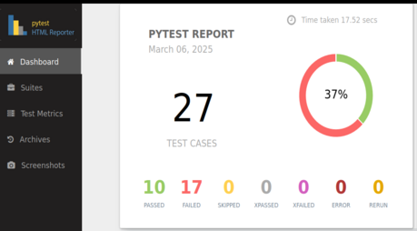
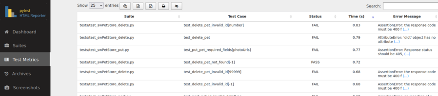

# Swagger petStore API testSuite 

🤖 A Python automated test suite to test the basic operations of [Swagger petStore API](https://petstore.swagger.io/) 🐶

## Installation and setup

Make sure you have python 3 or higher installed. It is recommended to install a virtual environment to avoid issues with dependencies.

### 1- Clone the repository

```bash
   git clone https://github.com/cfvergarac/SwaggerPet-test.git
```

### 2- Create and activate a virtual environment
      
```bash
    python -m venv venv
    source venv/bin/activate # On Linux, Mac
    venv\Scripts\activate # On Windows
```

### 3- Install dependencies
      
```bash
    pip install -r requirements.txt
```

## Running Tests

To run the tests, run the following command

```bash
   pytest
```

### 5- View the test report

After execution open the file "pytest_html_report.html" to see a detailed report of execution





## Tech Stack

 - python 3.10.12

## Dependencies

pytest  
httpx  
pytest-asyncio  
pydantic  
PyJWT  
pytest-html-reporter  

## Version

   v1.5.0

## Authors

- [@cfvergarac](https://www.github.com/cfvergarac)
